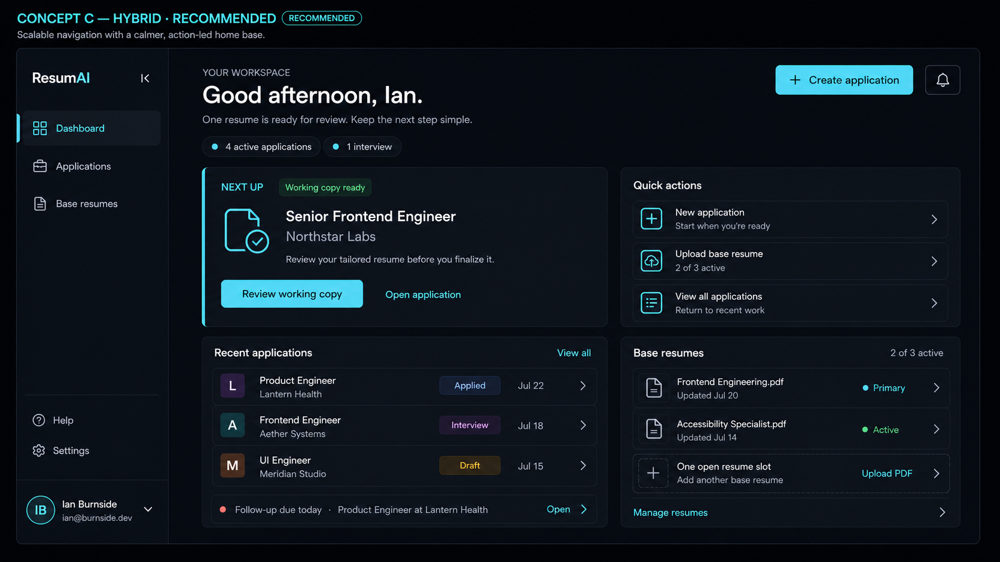

# Dashboard Design Specification

## Status and authority

Concept C — Hybrid is the approved dashboard direction for ResumAI V2.

This committed image is the visual reference until the team can recreate the
dashboard as an editable Figma frame. Figma access is an artifact limitation,
not an unresolved product or design decision.

When implementation details appear to conflict, use this order of authority:

1. The approved copy and spacing refinements recorded in this document.
2. The layout, hierarchy, and proportions shown in the Concept C image.
3. The existing authentication visual language for typography, colors, borders,
   radii, elevation, focus treatment, and restrained motion.

The authentication exploration remains available in
[Figma](https://www.figma.com/design/nTdovxL6aEm5xYseRelD3X/ResumAI-V2-%E2%80%94-OWL-12-Authentication-Exploration?node-id=9-531).
The implementation also records its approved design tokens in
`app/assets/css/main.css`.

Names, companies, roles, dates, counts, and resume filenames in the concept
image are realistic mock data. They demonstrate hierarchy and density; they
must not be hard-coded as product content.

## Purpose

The dashboard is the authenticated user's home base. It should answer three
questions quickly:

- Where am I in my job search?
- What needs my attention?
- What should I do next?

It welcomes the user, provides concise summary context, identifies one clear
next action, and offers quick access to recent applications and base resumes.
The experience should remain calm, trustworthy, and comfortable during a
stressful job search.

## Non-responsibilities

The dashboard is not:

- an analytics or reporting dashboard;
- a spreadsheet or complete application-management interface;
- the owner of detailed application, resume, or profile editing;
- a place for speculative metrics, charts, gamification, or activity feeds;
- permission to introduce notification, search, or reminder systems that have
  not been approved as product behavior.

The Applications area owns detailed application management. The Base Resumes
area owns detailed resume management.

## Information hierarchy

The approved order is:

1. Authenticated application shell and primary navigation.
2. Welcome and summary context.
3. One dominant item ready for the user's attention.
4. Small, relevant quick actions.
5. Recent applications preview.
6. Base-resume readiness and remaining capacity.
7. Authenticated user identity and account menu.

The page should never present several cards as equally important. The primary
action owns the strongest visual weight; everything else supports orientation
or navigation.

## Approved copy

Use the following copy in the approved direction:

| Context              | Copy                                   |
| -------------------- | -------------------------------------- |
| Greeting             | `Welcome back, {first name}.`          |
| Summary              | `You have one resume ready to review.` |
| Primary-card eyebrow | `Ready for review`                     |
| Working-copy status  | `Working copy ready`                   |
| Primary action       | `Review working copy`                  |
| Secondary action     | `Open application`                     |
| Quick action         | `Create application`                   |
| Quick action         | `Upload base resume`                   |
| Quick action         | `View applications`                    |
| Resume capacity      | `2 of 3 resumes`                       |
| Open slot            | `1 resume slot available`              |

The name and numerical values are dynamic product content. Grammar must adapt
to zero, singular, and plural values rather than forcing these examples into
every state.

Do not use the earlier line “Keep the next step simple.” The hierarchy should
communicate that principle without explaining it.

## Desktop layout

At desktop widths of approximately 1280px and above:

- Use a slim expanded sidebar approximately 216px wide.
- Keep the main canvas fluid and use roughly 48px horizontal padding.
- Separate the welcome header from the workspace content by approximately
  40px.
- Use a consistent 24px gap between content panels.
- Divide both content rows into the same approximately 56/44 proportions.
- Give the primary action panel slightly more width and internal space than the
  quick-actions panel.
- Align the two upper panels to equal height.
- Preserve the same column relationship for Recent Applications and Base
  Resumes below.
- Use approximately 32px internal padding in the primary card and 24px in
  supporting cards.

The main content should use available desktop space without introducing an
arbitrary narrow maximum width. Lines of body copy should still remain
comfortably readable.

The welcome header contains the greeting, summary, restrained status context,
and the primary `Create application` action. Summary values such as active
applications or interviews provide orientation; they are not KPI cards and
must not expand into analytics.

## Collapsed-sidebar behavior

At intermediate widths, approximately 768px through 1279px:

- Collapse the persistent sidebar to an approximately 72px icon rail.
- Retain the navigation order and a clearly visible active state.
- Provide an accessible name and discoverable tooltip for every icon-only
  control.
- Condense the user identity to an avatar or account-menu trigger.
- Allow the main content to use the released width without changing the
  information hierarchy.
- Preserve the two-column content layout when both columns remain readable.
- Stack panels into one column below approximately 1024px rather than squeezing
  their contents.

Expanded and collapsed navigation are two presentations of the same navigation
model. They must not maintain separate route logic or active-state ownership.

## Mobile behavior

Below approximately 768px:

- Replace the persistent sidebar with a compact top application bar.
- Open navigation from a labelled menu trigger into a dismissible drawer.
- Keep the current page and user identity understandable when the drawer is
  closed.
- Present dashboard content in one column.
- Keep the primary action first, followed by quick actions, recent
  applications, and base resumes.
- Reduce outer padding to approximately 16–20px while preserving 16–24px
  vertical rhythm.
- Allow buttons and status chips to wrap without horizontal scrolling.
- Prefer removing secondary dates or metadata before truncating role or company
  identity.
- Keep interactive targets at least 44px high where practical.

The navigation drawer must close through its explicit control, Escape, route
selection, and interaction outside the drawer. Focus must move into the drawer
when opened and return to its trigger when closed.

## Navigation

The durable primary destinations are:

1. Dashboard
2. Applications
3. Base resumes

Dashboard is visibly selected on this page. The expanded sidebar uses icons and
labels; the collapsed rail uses the same icons with accessible names.

The Concept C image reserves lower-sidebar placement for Help and Settings.
Those positions may remain part of the future shell, but OWL-15 does not approve
new routes or dead controls. Do not expose them as interactive navigation until
their destinations and behavior exist.

The notification icon in the concept image is also non-authoritative contextual
decoration. A notification system is outside the approved dashboard scope.

The account control is visually separate from product navigation. It identifies
the authenticated user and provides access to existing account actions such as
sign-out; it does not imply profile editing.

## Primary action

The largest card presents the single most relevant recoverable action. In the
approved populated example, a tailored working copy is ready for review.

The card contains:

- the `Ready for review` eyebrow;
- the `Working copy ready` status;
- the role and company;
- a short explanation;
- the primary `Review working copy` action;
- the secondary `Open application` action.

It should use restrained cyan emphasis, generous internal spacing, and a simple
document-status icon. It must not become a carousel, task inbox, or competing
collection of alerts.

Future empty, loading, and error states should preserve the card's ownership of
the next useful action while using truthful state-specific content.

## Quick actions

The quick-actions panel provides three compact shortcuts:

- `Create application`
- `Upload base resume`
- `View applications`

Each row contains an icon, label, brief supporting text when space permits, and
a clear interaction affordance. These shortcuts must not duplicate detailed
management interfaces.

## Recent applications

Recent Applications is a preview of recent work, not a table or full tracker.
Each item prioritizes:

1. role;
2. company;
3. application or tailoring status;
4. date when space permits;
5. navigation affordance.

The panel should contain a small bounded number of records and a `View all`
action that delegates detailed management to Applications.

A follow-up reminder may appear as optional contextual content within this
panel when supported by approved product data. It is not a separate dashboard
section, required dashboard state, or independently owned reminder system.

## Base resumes

The Base Resumes panel communicates source-document readiness and capacity. It
shows a small preview of active resumes, identifies a primary resume when that
concept exists in approved product behavior, and communicates the three-resume
limit.

The approved populated example uses `2 of 3 resumes` and
`1 resume slot available`. Detailed upload, replacement, and management behavior
belongs to Base Resumes rather than the dashboard.

## Responsibility boundaries

- The **application shell** owns overall layout and responsive navigation.
- **Primary navigation** owns destinations and active-route presentation.
- The **welcome area** owns greeting, summary context, and the primary creation
  entry point.
- The **primary action panel** owns only the highest-priority next action.
- **Quick actions** own shortcuts to existing workflows.
- **Recent Applications** owns a bounded preview and may include optional
  contextual follow-up content.
- **Base Resumes** owns a bounded readiness and capacity preview.
- The **account menu** owns authenticated identity presentation and existing
  session actions.

These are responsibility boundaries, not required Vue component names or
permission to create speculative abstractions.

## Accessibility and motion

- All navigation and actions must be operable by keyboard.
- Focus treatment must use the established high-contrast focus color.
- Icon-only controls require accessible names and visible tooltips where they
  aid discovery.
- Status must be communicated by text, not color alone.
- Text and controls must preserve sufficient contrast on graphite surfaces.
- Motion should be limited to restrained hover, focus, menu, and layout
  transitions.
- Reduced-motion preferences must disable non-essential movement.
- Essential information and actions must never depend on hover.

## Deferred editable design

An editable dashboard frame will be produced when Figma MCP access is
available. Until then, implementation review should compare the product against
the committed Concept C image and this specification. Recreating the frame
later must preserve approved behavior and copy rather than reopening the
dashboard direction by default.
